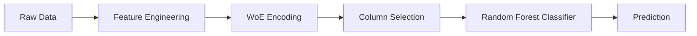
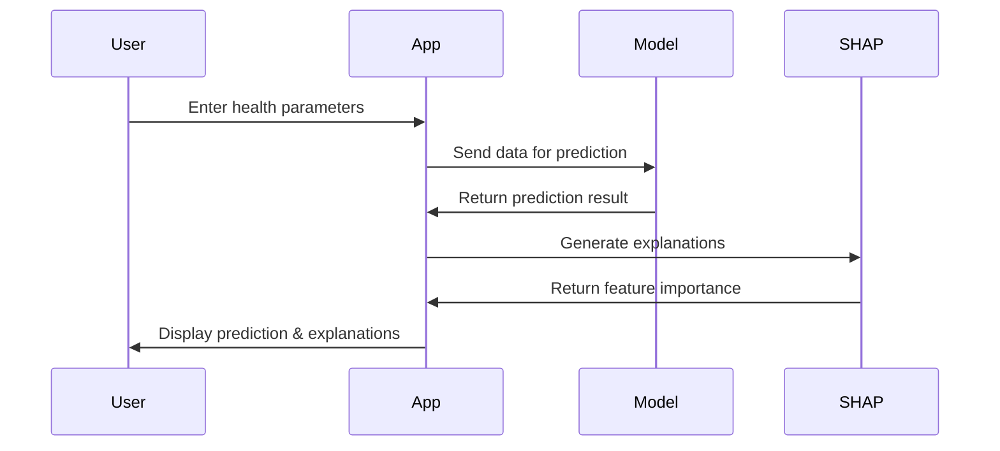

<div align="center">

# 🩺 Diabetes Prediction with AI

[](https://www.python.org/downloads/)
[](https://streamlit.io/)
[](https://scikit-learn.org/)
[](https://github.com/slundberg/shap)
[](LICENSE)

<p align="center">
  <i>An interactive web application for predicting diabetes risk using machine learning and explainable AI</i>
</p>

</div>

## 📋 Table of Contents
- [🔍 Overview](#-overview)
- [✨ Key Features](#-key-features)
- [📊 Dataset](#-dataset)
- [🧠 Model](#-model)
- [🚀 Demo](#-demo)
- [⚙️ Installation & Usage](#️-installation--usage)
- [📁 Project Structure](#-project-structure)
- [📈 Model Performance](#-model-performance)
- [🔮 Explanation Methods](#-explanation-methods)
- [💡 Project Motivation](#-project-motivation)
- [🤝 Contributing](#-contributing)
- [📄 License](#-license)

---

## 🔍 Overview

The **Diabetes Prediction with AI** project leverages a machine learning model to predict diabetes risk based on health parameters. Built with **Streamlit**, the application provides:

- **Real-time predictions** of diabetes risk
- **Explainable AI** using SHAP and permutation importance
- **Interactive visualizations** of model performance and feature importance
- **User-friendly interface** for entering health data

> ⚠️ **Disclaimer**: This model has not been reviewed by medical professionals and is developed solely for experimental and educational purposes. Do not use for medical diagnosis.

### Why This Project?

Understanding diabetes risk through data-driven predictions can help identify potential cases early. This project demonstrates:
- 🔬 Practical application of machine learning in healthcare
- 🔍 Advanced model interpretability techniques
- 🌐 Real-world deployment of AI solutions
- 📊 Data visualization for complex medical insights

---

## ✨ Key Features

<div align="center">
<table>
  <tr>
    <td align="center"><b>🔄 Interactive Input</b></td>
    <td align="center"><b>🧪 Diabetes Prediction</b></td>
    <td align="center"><b>📊 SHAP Explanations</b></td>
    <td align="center"><b>📈 Performance Metrics</b></td>
  </tr>
  <tr>
    <td>Enter health parameters (Pregnancies, Glucose, Insulin, BMI, Age)</td>
    <td>Real-time risk prediction with probability score</td>
    <td>Visualize individual prediction explanations with Waterfall and Force plots</td>
    <td>View Accuracy, Precision, Recall, F1 Score, and ROC AUC</td>
  </tr>
</table>
</div>

## 📊 Dataset

The dataset is sourced from the **National Institute of Diabetes and Digestive and Kidney Diseases** and contains diagnostic measurements for 768 female patients of Pima Indian heritage.

### 📋 Dataset Overview

- **Source**: National Institute of Diabetes and Digestive and Kidney Diseases
- **Instances**: 768 observations
- **Features**: 8 numeric predictive attributes + target variable
- **Target**: Diabetes diagnosis (1 = positive, 0 = negative)
- **Class Distribution**: 34.9% positive cases (268), 65.1% negative cases (500)

### 📝 Feature Descriptions

| Feature | Description | Type | Range |
|---------|-------------|------|-------|
| **Pregnancies** | Number of times pregnant | Integer | 0-17 |
| **Glucose** | Plasma glucose concentration (2 hours in OGTT) | Integer | 0-199 |
| **BloodPressure** | Diastolic blood pressure (mm Hg) | Integer | 0-122 |
| **SkinThickness** | Triceps skin fold thickness (mm) | Integer | 0-99 |
| **Insulin** | 2-Hour serum insulin (mu U/ml) | Integer | 0-846 |
| **BMI** | Body mass index (weight in kg/(height in m)²) | Float | 0-67.1 |
| **DiabetesPedigreeFunction** | Diabetes pedigree function | Float | 0.078-2.42 |
| **Age** | Age in years | Integer | 21-81 |
| **Outcome** | Class variable (0 or 1) | Integer | 0-1 |

> **Note**: For prediction, we primarily use `Pregnancies`, `Glucose`, `BMI`, `Insulin`, and `Age` as these were found to be the most predictive features.

---

## 🧠 Model

The prediction model uses a **Random Forest Classifier** optimized for diabetes prediction. You can explore the detailed model development process in the [Model Notebook](notebooks/Model.ipynb).

<div align="center">

### 🔄 Model Pipeline



</div>

### 🛠️ Model Components

#### 1. Random Forest Classifier
- **Algorithm**: Ensemble learning method using multiple decision trees
- **Hyperparameters**: Optimized using `optuna` for best performance
- **Evaluation**: Cross-validation with ROC AUC metric
- **Threshold**: Optimized for recall due to medical context

#### 2. Data Transformation Pipeline

| Component | Description | Purpose |
|-----------|-------------|---------|
| **Feature Engineering** | Creates derived features from raw inputs | Enhances predictive power by generating new informative features |
| **WoE Encoding** | Weight of Evidence transformation | Converts categorical variables into continuous features based on target relationship |
| **Column Selector** | Selects the most important features | Reduces dimensionality and removes noise |

#### 3. Feature Transformations

- **Feature Engineering**: Creates derived features like:
  - `PregnancyRatio`: Pregnancy count relative to age
  - `RiskScore`: Composite score based on multiple risk factors
  - `InsulinEfficiency`: Relationship between insulin and glucose
  - `Glucose_BMI`: Interaction between glucose and BMI
  - `BMI_Age`: Age-adjusted BMI score

- **WoE Encoding Formula**:
  ```
  WoE = ln(P(Feature = X | Target = 1) / P(Feature = X | Target = 0))
  ```
  Where:
  - Higher positive values indicate stronger association with diabetes
  - Negative values indicate association with non-diabetes

---

## 🚀 Demo

<div align="center">

### Application Screenshots

| Prediction Screen | Explanation View | Performance Metrics |
|:---:|:---:|:---:|
|  |  |  |

</div>

## ⚙️ Installation & Usage

### Prerequisites
- Python 3.10 or above
- Git

### Setup Instructions

1. **Clone the repository**
   ```bash
   git clone https://github.com/dushyantzz/Diabetes-Prediction-App.git
   cd Diabetes-Prediction-App
   ```

2. **Create a virtual environment**
   ```bash
   python -m venv diabetes_env
   ```

3. **Activate the virtual environment**
   - Windows:
     ```bash
     diabetes_env\Scripts\activate
     ```
   - macOS/Linux:
     ```bash
     source diabetes_env/bin/activate
     ```

4. **Install dependencies**
   ```bash
   pip install -r requirements.txt
   ```

5. **Run the application**
   ```bash
   streamlit run main.py
   ```
   
   Alternatively, use the provided batch script (Windows):
   ```bash
   .\run_app.bat
   ```

6. **Access the application**
   - Open your browser and navigate to: http://localhost:8501

### How It Works

<div align="center">



</div>

1. **Input Health Data**: Enter your health parameters (Pregnancies, Glucose, Insulin, BMI, Age)
2. **Get Prediction**: The model analyzes your data and provides a diabetes risk prediction
3. **Explore Explanations**: View SHAP visualizations to understand which factors influenced your prediction
4. **Review Performance**: Check the model's accuracy and reliability metrics

## 📁 Project Structure

```
Diabetes-Prediction/
├── README.md                 # Project documentation
├── main.py                   # Entry point for the Streamlit app
├── loader.py                 # Data loading and preprocessing
├── training.py               # Script for training the model
├── requirements.txt          # Project dependencies
├── run_app.bat               # Batch script to run the application
├── LICENSE                   # License file
├── .gitignore                # Git ignore file
├── datasets/                 # Data directory
│   └── diabetes.csv          # Dataset used for training and predictions
├── model.pkl                 # Trained machine learning model
├── image/                    # Image assets
│   └── page_icon.jpeg        # Application page icon
├── data/                     # Data configuration
│   ├── config.py             # Configuration variables
│   └── base.py               # Static HTML/CSS content
├── function/                 # Utility functions
│   ├── model.py              # Custom model implementation
│   ├── function.py           # Utility functions
│   └── transformers.py       # Data transformation classes
├── notebooks/                # Jupyter notebooks
│   └── Model.ipynb           # Model development notebook
└── app/                      # Application components
    ├── predict.py            # Prediction logic
    ├── explainer.py          # SHAP-based explanations
    ├── perm_importance.py    # Permutation importance analysis
    ├── performance.py        # Visualization of model performance metrics
    ├── input.py              # User input handling for predictions
    ├── header.py             # Application header component
    └── about.py              # Informational section on diabetes
```

## 🔮 Explanation Methods

<div align="center">

| Method | Description | Visual Example |
|--------|-------------|----------------|
| **SHAP Waterfall Plot** | Shows how each feature contributes to pushing the prediction from the base value to the final prediction |  |
| **SHAP Force Plot** | Interactive visualization showing the push and pull of features on the model output |  |
| **Permutation Importance** | Ranks features by their impact on model performance when randomly shuffled |  |

</div>

## 📈 Model Performance

<div align="center">

### Performance Metrics

| Metric | Value | Description |
|--------|-------|-------------|
| **Accuracy** | 0.7857 | Percentage of correct predictions |
| **Precision** | 0.6296 | Ratio of true positives to total positive predictions |
| **Recall** | 0.9444 | Ratio of true positives to total actual positives |
| **F1 Score** | 0.7556 | Harmonic mean of Precision and Recall |
| **ROC AUC** | 0.8367 | Area under the ROC curve |

</div>

> **Note**: High recall (0.9444) was prioritized over precision due to the medical context, where identifying potential diabetes cases (even with some false positives) is more important than missing actual cases.

## 💡 Project Motivation

This project was developed to:

- 🔬 **Explore ML in Healthcare**: Apply machine learning techniques to a real-world medical problem
- 🔍 **Master Explainable AI**: Gain hands-on experience with model interpretability using SHAP
- 🚀 **Build Interactive Applications**: Learn to deploy ML models through Streamlit's interactive interface
- 📊 **Visualize Complex Data**: Create intuitive visualizations for medical data and predictions
- 🌱 **Contribute to Public Health**: Provide an educational tool for understanding diabetes risk factors

## 🤝 Contributing

Contributions are welcome! Here's how you can help improve this project:

1. **Fork the repository**
2. **Create a feature branch**:
   ```bash
   git checkout -b feature/your-feature-name
   ```
3. **Make your changes**
4. **Commit with descriptive messages**:
   ```bash
   git commit -m "Add feature: description of your changes"
   ```
5. **Push to your branch**:
   ```bash
   git push origin feature/your-feature-name
   ```
6. **Open a pull request**

### Contribution Ideas
- Improve model accuracy
- Add new visualization types
- Enhance the user interface
- Expand the dataset with additional features
- Add unit tests
- Improve documentation

## 📄 License

This project is licensed under the MIT License - see the [LICENSE](LICENSE) file for details.

---

<div align="center">

### 🙏 Thank you for your interest in the Diabetes Prediction App!

[](https://github.com/dushyantzz/Diabetes-Prediction-App/stargazers)
[](https://github.com/dushyantzz/Diabetes-Prediction-App/network/members)

</div>
